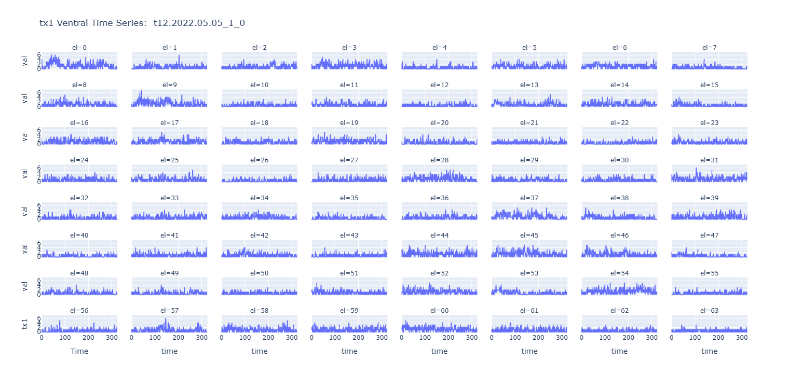
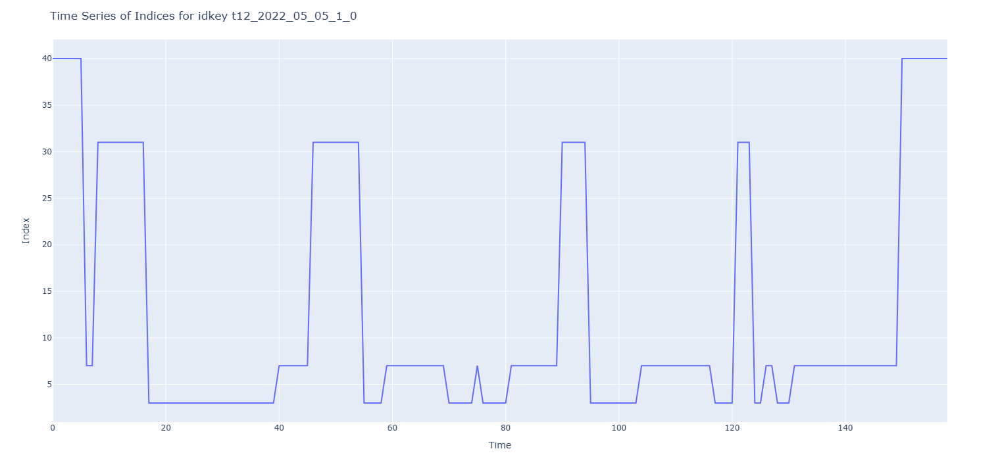

# SpeechBCI

The purpose of this repo is to explore an open-source data set comprised of electrode array recordings of nueral activity during speech generation.

* Willett, et al. (2023). A high-performance neural speech prosthesis. _Nature_. 620:1031-1036.
* https://datadryad.org/dataset/doi:10.5061/dryad.x69p8czpq

Skills applied: Python, PyTorch, CNN, VQ-VAE, CUDA/GPU, AWS, Visual Studio Code, GitHub Co-Pilot, Computer Vision.

Note: This repo reflects work in progress.  So, like a lab bench, there could be items scattered here and there.
At any given moment things may or may not be fully working.  Once everything settles down, we'll create a prod/ folder
to distinguish stable working code.

## Description

The following set of slides describes this project at its outset.  As project progresses we will update.  Or if results merit such, we'll write a paper.
[Speech Decoding Pilot Study (Kamil Grajski 28Feb2025).pdf](https://github.com/user-attachments/files/19057861/Speech.Decoding.Pilot.Study.Kamil.Grajski.28Feb2025.pdf)

This animation is from a single trial during which the subject "spoke" a sentence.
Each point in the grid corresponds to an electrode.  The data is shown as a heat map movie.
You may have to download the file and view it in your browser.

This image is from the same animation as above, but shown as a time series.
You may have to download the file and view it in your browser.

Note: If you get the message that git cannot display such large html then download the figs folder and display locally.

## Getting Started

Assuming that one has gained access to the dataset, there are two stages to using this code.
* The ETL stage is implemented in the **etl.py**d script.
     This dices and slices and rearranges the raw data based on the Willett paper and data set README.
     This is a necessary step to make sure that processing and display can be mapped backed to physical location of the electrode.
* The VQ-VAE stage is implemented in the **dev_vqvae.py** script.
     This script manages the training, testing, and validation loop for the ETL data.
     The script leverages GPU if available and puts results to TensorBoard
     This was used for 2D exploration.
* The VQ-VAE 3D stage is implemented in the **main_vqvae3D.py**.  Have refactored code to push the functions needed to run experiments to **utils_vqvae.p**y.

## Why The Excitement to Proceed?
The plot below shows the time series of trained VQ-VAE codebook indexes for a sample sentence from the speechBCI dataset.
If the idea to use VQ-VAE was bogus, one might expect to see a random sequence of indexes.
While the indexes have no intrinsic meaning, we are delighted to see what look like short segments of repeated values.
They appear to be of the duration one likes to see for a neural speech coding.  Next step is to train some LLMs!

### Dependencies

* No special requirements beyond the imports listed in the scripts.
* This repo was developed and executed on AWS via VSS Code.

### Installing

* No special requirements beyond the imports listed in the scripts.
* This repo was developed and executed on AWS via VSS Code.

### Executing program

* See Getting Started above.

## Help

Send an email to: kgrajski@nurosci.com

## Authors

Kamil A. Grajski (kgrajski@nurosci.com)

## Version History

* 0.1
    * Initial Release

## License

This project is licensed under the [NAME HERE] License - see the LICENSE.md file for details

## Acknowledgments

It is fantastic that Willett lab made available a dataset!
Additional Acknowledgements and References are in the individual code files.

